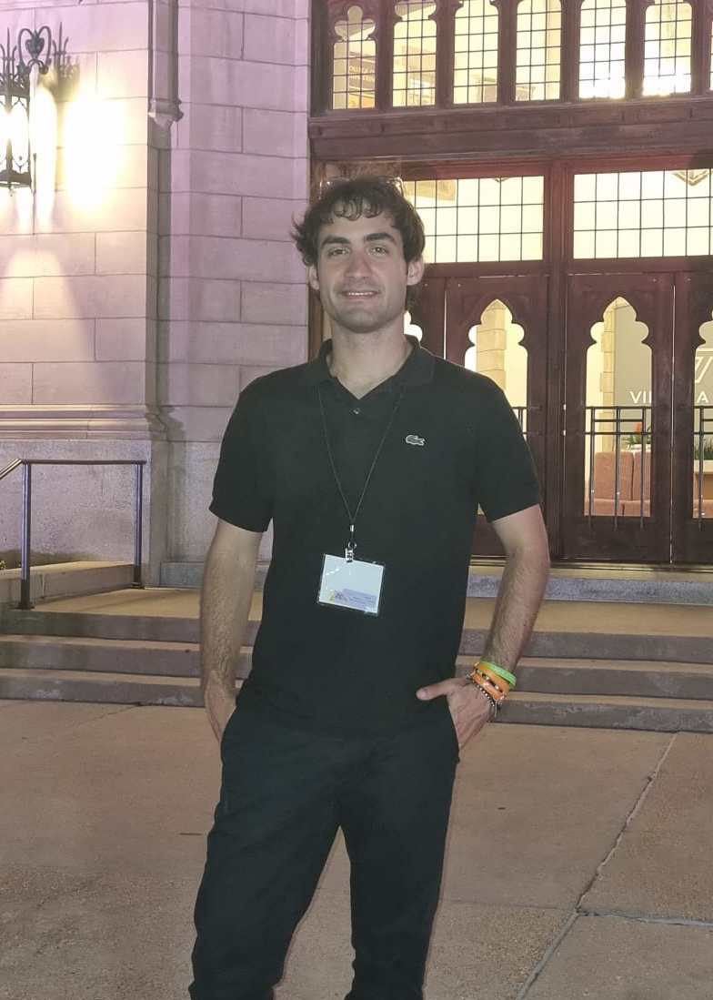

Numerical Linear Algebra, Matrix Optimization, and Randomized Algorithms

I am a PhD student in Mathematics at the Gran Sasso Science Institute (GSSI), under the supervision of Nicola Guglielmi. I obtained both my Bachelor’s and Master’s degrees in Mathematics from the University of Bologna.

My research interests lie in numerical linear algebra, matrix computations, and randomized algorithms for large-scale problems.

During my Master’s thesis, supervised by Valeria Simoncini, I worked on projection and Krylov methods for large-scale matrix equations arising from PDE discretizations, with particular emphasis on sketching techniques and truncated Krylov methods.

Currently, my research focuses on matrix nearness problems, namely optimization problems in which a given matrix is projected onto sets of structured matrices, such as correlation or covariance matrices. In this context, I am particularly interested in structure-preserving algorithms, eigenvalue computations, and fast numerical methods for large-scale optimization problems.

I am also interested in randomized numerical linear algebra, especially sketching methods, randomized eigensolvers, and randomized techniques for matrix computations and large-scale optimization.

**Email:** eugenio.turchet@gssi.it

## Research interests

- Numerical Linear Algebra
- Matrix Nearness Problems
- Randomized Numerical Linear Algebra
- Krylov and Projection Methods
- Eigenvalue Problems
- Matrix Optimization
- Structure-Preserving Algorithms
- Large-Scale Matrix Computations